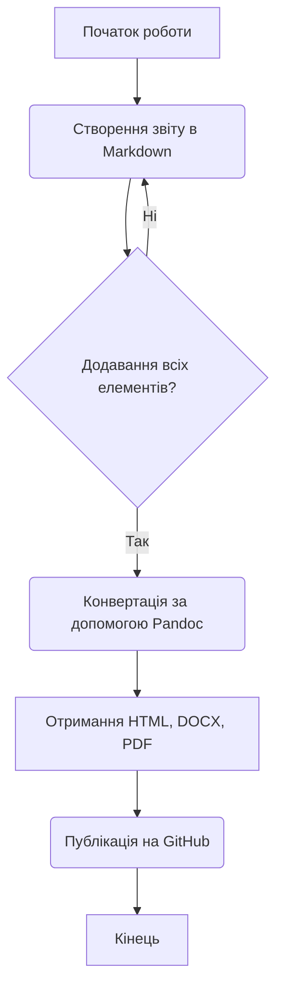

# Звіт до лабораторної роботи №3: Основи Markdown

Цей документ є звітом до лабораторної роботи №3. Метою роботи було ознайомлення з синтаксисом Markdown, створення структурованого документа, що містить списки, математичні формули, таблиці та діаграми. Також було розглянуто процес конвертації файлу у формати HTML, DOCX та PDF за допомогою утиліти Pandoc та публікація результатів на GitHub.

## П'ять улюблених книг

1. Роберт Чалдині - "Психологія впливу"
2. Деніел Канеман - "Мислення швидке й повільне"
3. Кріс Восс - "Ніколи не йдіть на компроміс"
4. Джеймс Клір - "Атомні звички"
5. Дональд Кнут - "Мистецтво програмування"

## Математичні формули

Формула Ейлера $e^{i\pi} + 1 = 0$ є однією з найкрасивіших у математиці.

**Рівняння для знаходження коренів квадратного рівняння:**

$$
x = \frac{-b \pm \sqrt{b^2 - 4ac}}{2a}
$$

**Рівняння еквівалентності маси та енергії:**

$$
E = mc^2
$$

## Діаграма процесу роботи

Діаграма, що ілюструє процес виконання цієї лабораторної роботи:

| Книга                        | Автор          | Кількість сторінок |
| :--------------------------- | :------------- | :----------------- |
| Психологія впливу            | Роберт Чалдині | 528                |
| Мислення швидке й повільне   | Деніел Канеман | 480                |
| Атомні звички                | Джеймс Клір    | 288                |
| Мистецтво програмування      | Дональд Кнут   | 650                |
| Ніколи не йдіть на компроміс | Кріс Восс      | 264                |

Під час виконання роботи я ознайомився з основами синтаксису Markdown, який є простим та зручним для написання структурованих документів. Використання утиліти Pandoc дозволяє легко перетворювати один вихідний файл у безліч форматів. Зберігання документації у Markdown на GitHub є надзвичайно ефективним для ведення проєктів.
